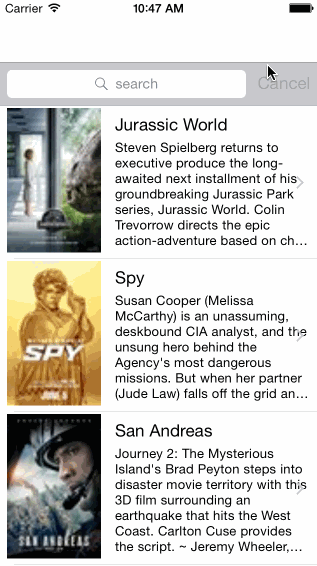

# movie

iOS training week 1

Time spent: 6 hours spent in total

Completed user stories:
 * [x] Required: User can view a list of movies from Rotten Tomatoes. Poster images must be loading asynchronously.
 * [x] Required: User can view movie details by tapping on a cell.
 * [x] Required: User sees loading state while waiting for movies API. You can use one of the 3rd party libraries at http://cocoapods.wantedly.com?q=hud.
 * [x] Required: User sees error message when there's a networking error. You may not use UIAlertView or a 3rd party library to display the error. See this screenshot for what the error message should look like: network error screenshot.
 * [x] Required: User can pull to refresh the movie list. Guide: Using UIRefreshControl
 * [x] Optional: Add a search bar.

Tips:
POD - https://cocoapods.org/
Rottoen Tomato API Application - http://developer.rottentomatoes.com/apps/mykeys

Walkthrough of all user stories:

GIF created with [LiceCap](http://www.cockos.com/licecap/).
